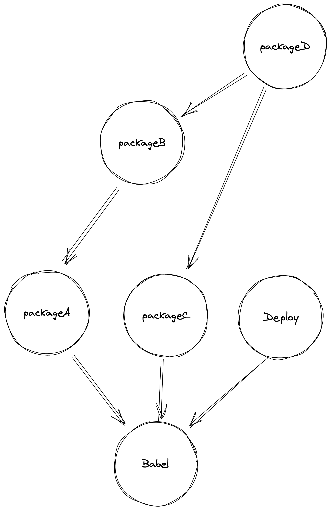

# monorepo 101 deployment

D depends on B and C
B depends on A

it should deploy based on git commit range

## How is the package dependencies?

If you change `package C`

you should test and deploy package `C` and `D` 
